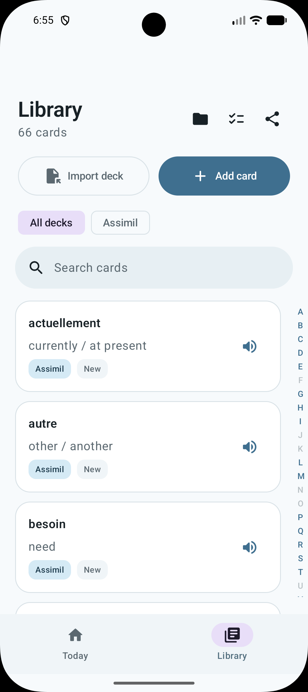
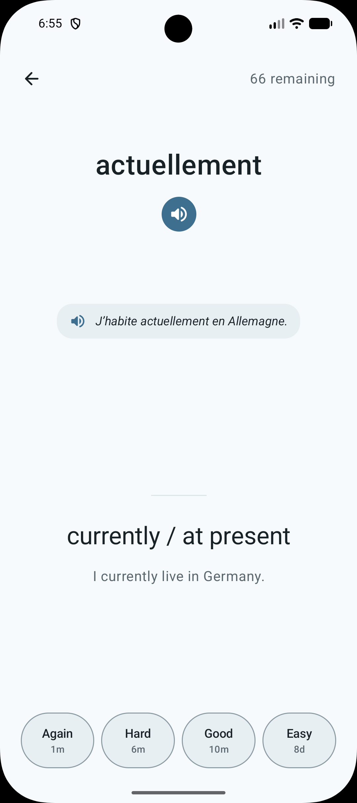
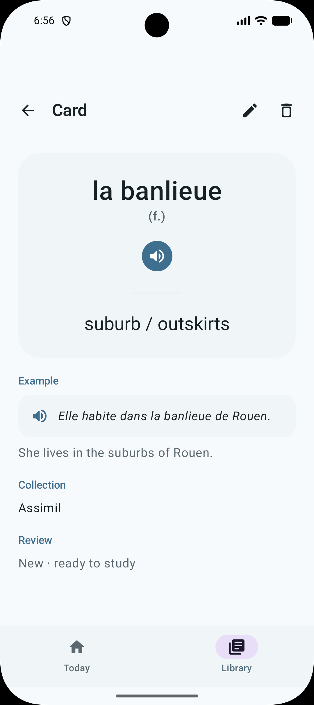

<p align="center">
  
</p>

<h1 align="center">Encore</h1>

<p align="center">
  <a href="https://github.com/xichen-de/encore/actions/workflows/ci.yml"></a>
  <a href="LICENSE"></a>
</p>

Encore is an offline French spaced-repetition app for Android. Cards and review progress are stored locally on the device; there is no account and no network dependency.

<p align="center">
  
  
  
</p>

## Features

- Spaced-repetition review (Again / Hard / Good / Easy) with per-card scheduling
- Searchable card library, organized by deck
- Deck import via `.fdeck` files
- Local storage only, no network access required

## Use the app

1. Open **Library** to add a card or import a `.fdeck` file.
2. Open **Today** and tap **Start review**.
3. Tap a card in **Library** to view or edit it.

## `.fdeck` format

A `.fdeck` file is UTF-8 JSON with this structure:

```json
{
  "format": "fdeck",
  "version": 1,
  "name": "Words learned today",
  "cards": [
    {
      "front": "à côté de",
      "back": "next to / beside"
    },
    {
      "front": "l’endroit",
      "back": "place",
      "gender": "m",
      "example": "C’est l’endroit idéal.",
      "exampleTranslation": "It’s the ideal place.",
      "note": "Common noun",
      "tags": ["daily", "lesson-15"]
    }
  ]
}
```

### Fields

| Field | Required | Value |
| --- | --- | --- |
| `format` | Yes | Must be `"fdeck"` |
| `version` | Yes | Must be `1` |
| `name` | Yes | Non-empty deck name |
| `cards` | Yes | Array of card objects |
| `front` | Yes | Non-empty French word or phrase |
| `back` | Yes | Non-empty English meaning |
| `gender` | No | `"m"` or `"f"` |
| `example` | No | French example sentence |
| `exampleTranslation` | No | English translation of the example |
| `note` | No | Additional context |
| `tags` | No | Array of text labels |

Save the JSON as a file ending in `.fdeck`. It is plain JSON, not a ZIP archive. Omit optional fields when they have no value.

A sample deck is available at [`samples/assimil-lesson-15.fdeck`](samples/assimil-lesson-15.fdeck).

## Develop

Requirements: JDK 17 or newer and Android SDK 37.

```bash
./gradlew testDebugUnitTest assembleDebug
```

The debug APK is written to `app/build/outputs/apk/debug/app-debug.apk`.

To compile the device parser tests:

```bash
./gradlew compileDebugAndroidTestKotlin
```

## License

Encore is licensed under the [MIT License](LICENSE).
