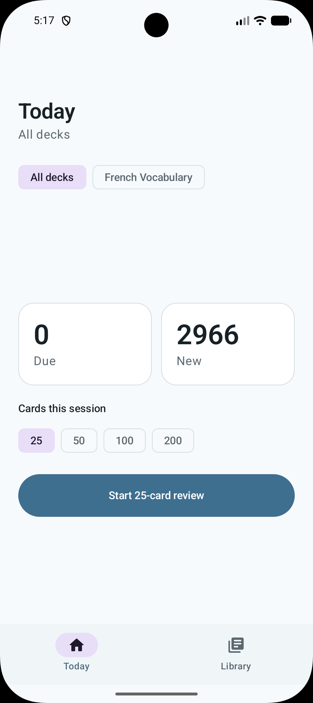
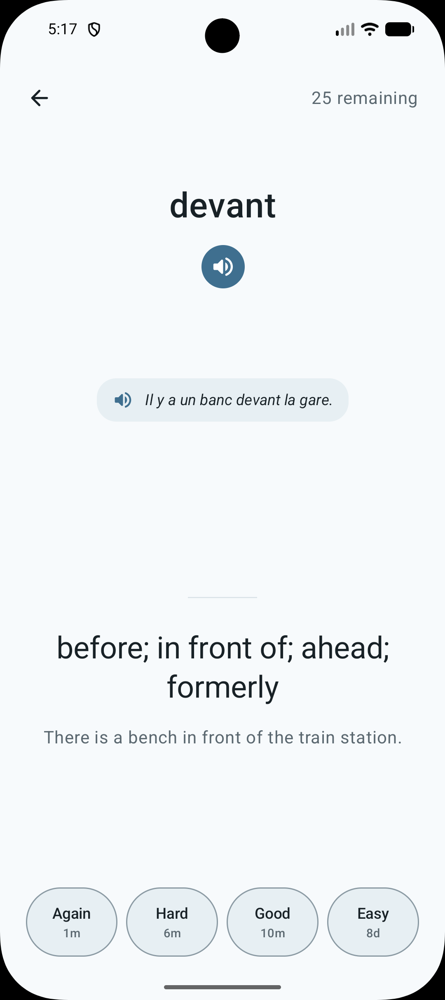
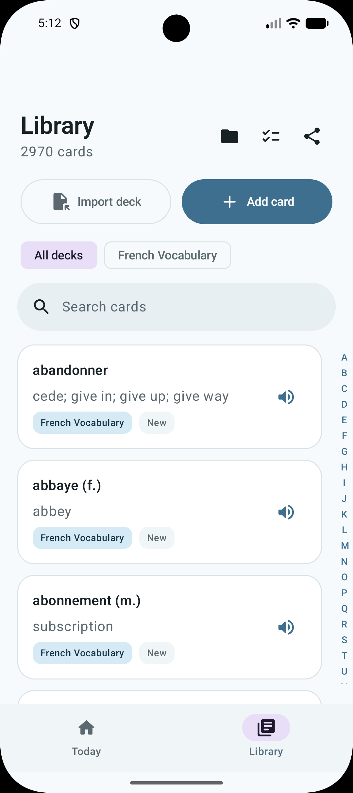
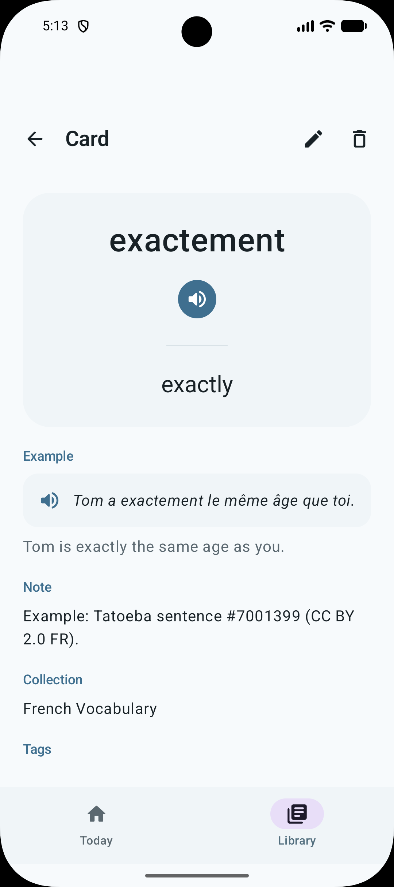

<p align="center">
  
</p>

<h1 align="center">Encore</h1>

<p align="center">
  <a href="https://github.com/xichen-de/encore/actions/workflows/ci.yml"></a>
  <a href="LICENSE"></a>
</p>

Encore is an offline French spaced-repetition app for Android. Cards and review progress are stored locally on the device; there is no account and the app does not request network access. Android's standard app backup (Google backup and device-to-device transfer) includes the card database and settings.

<p align="center">
  
  
  
  
</p>

## Features

- Spaced-repetition review (Again / Hard / Good / Easy) scheduled with [FSRS-6](https://github.com/open-spaced-repetition/fsrs4anki/wiki/The-Algorithm) default parameters at 90% target retention, with 1 min / 10 min learning steps and a 10 min relearning step
- Review sessions of 25, 50, 100, or 200 cards, for all decks or a single deck
- French pronunciation of words and examples via the device's text-to-speech engine (a French voice must be installed)
- Searchable card library, organized by deck, with rename and delete for decks
- Add, edit, delete, and reset the progress of individual cards or a multi-card selection
- Deck import and export via `.fdeck` files
- Local storage only, no network access required

## Use the app

1. Open **Library** to add a card or import a `.fdeck` file. You can also open a `.fdeck` file from a file manager and choose Encore.
2. Open **Today**, choose a deck and session size, and tap **Start review**.
3. Tap a card in **Library** to view, edit, or reset it. Use the folder icon to rename or delete decks.
4. Use the share icon in **Library** to export the cards currently shown (the selected deck and search filter apply) as a `.fdeck` file.

## `.fdeck` format

A `.fdeck` file is UTF-8 JSON with this structure:

```json
{
  "format": "fdeck",
  "version": 1,
  "name": "Words learned today",
  "cards": [
    {
      "front": "à côté de",
      "back": "next to / beside"
    },
    {
      "front": "l’endroit",
      "back": "place",
      "gender": "m",
      "example": "C’est l’endroit idéal.",
      "exampleTranslation": "It’s the ideal place.",
      "note": "Common noun",
      "tags": ["daily", "lesson-15"]
    }
  ]
}
```

### Fields

| Field | Required | Value |
| --- | --- | --- |
| `format` | Yes | Must be `"fdeck"` |
| `version` | Yes | Must be `1` |
| `name` | Yes | Non-empty deck name |
| `cards` | Yes | Array of card objects |
| `front` | Yes | Non-empty French word or phrase |
| `back` | Yes | Non-empty English meaning |
| `gender` | No | `"m"` or `"f"` (case-insensitive) |
| `example` | No | French example sentence |
| `exampleTranslation` | No | English translation of the example |
| `note` | No | Additional context |
| `tags` | No | Array of text labels |

Save the JSON as a file ending in `.fdeck`. It is plain JSON, not a ZIP archive. Omit optional fields or set them to `null` when they have no value. Leading and trailing whitespace is trimmed, and empty optional text is ignored.

### Import behavior

Two cards are identical when their `front` and `back` match after Unicode (NFKC) normalization, lowercasing, and whitespace collapsing. Before importing, Encore shows a preview with:

- **New cards**: cards not yet in the library
- **Already in library**: identical cards that already exist, in any deck
- **Repeated in file**: extra copies of a card within the same file, which are imported once

For cards already in the library, you choose to skip them, fill only missing details (gender, example, note, tags), move the existing card into the import deck, or keep an additional copy with fresh progress. A card with the same `front` but a different `back` is imported as a separate card. Imported cards keep no review history; export does not include progress either.

A sample deck is available at [`samples/french-vocabulary.fdeck`](samples/french-vocabulary.fdeck).

## Develop

Requirements: Android SDK 37 and a JDK to launch Gradle. The Gradle daemon runs on JDK 25 (see `gradle/gradle-daemon-jvm.properties`); if JDK 25 is not installed locally, Gradle downloads it on first use.

```bash
./gradlew testDebugUnitTest lintDebug assembleDebug
```

The debug APK is written to `app/build/outputs/apk/debug/app-debug.apk`. It installs alongside a release build as `app.encore.french.debug`.

The instrumented tests (JSON parsing on the Android runtime and the Room repository) need a connected device or emulator:

```bash
./gradlew connectedDebugAndroidTest
```

## Release

Pushing a tag such as `v1.2.3` or `v1.2.3-rc.1` runs [`android-release.yml`](.github/workflows/android-release.yml), which tests, lints, builds a signed APK, and publishes it with a `SHA256SUMS` file as a GitHub release. Tags with a suffix are published as prereleases. The version code is `major * 1000000 + minor * 1000 + patch`. The workflow needs the repository secrets `ANDROID_KEYSTORE_BASE64`, `ANDROID_KEYSTORE_PASSWORD`, `ANDROID_KEY_ALIAS`, and `ANDROID_KEY_PASSWORD`.

For a local signed release build, create an untracked `keystore.properties` in the project root with `storeFile`, `storePassword`, `keyAlias`, and `keyPassword`, then run `./gradlew assembleRelease`.

## License

Encore is licensed under the [MIT License](LICENSE).
